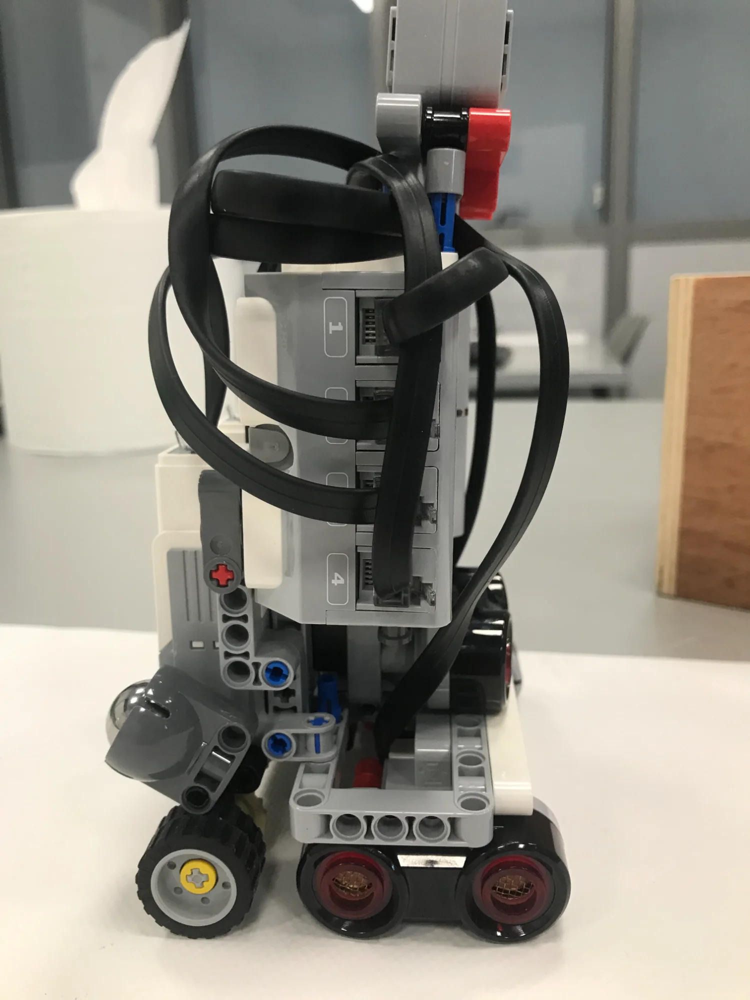
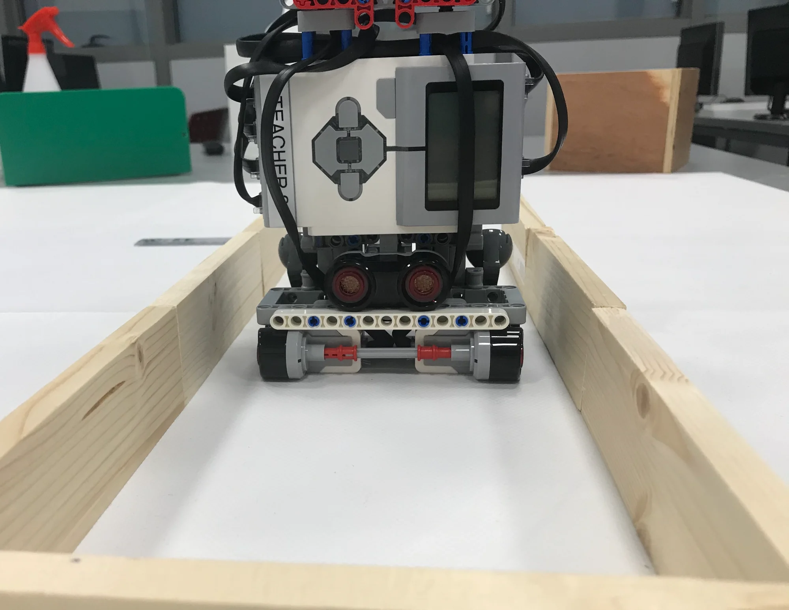

# Robotex Maze Solver

A flood-fill based maze-solving algorithm I developed in 2020 for the Robotex Cyprus LEGO Mindstorms EV3 competition.

## What It Does

The goal is simple: the robot should autonomously navigate a maze and reach its center as fast as possible.

The robot uses **three ultrasonic sensors** (front, left, right) to detect walls and a **gyro sensor** for accurate turns. Based on what it "sees," it decides which direction to move using an optimized flood-fill algorithm. The main idea of the flood-fill algorithm is that it assigns each cell in the maze a number representing its distance from the center and the robot always moves toward cells with lower numbers, just like water flowing downhill.

This repository contains the **decision-making logic with a terminal visualization/simulator**. You run it in your terminal, manually input sensor readings (simulating what the robot would detect), and watch it calculate moves and visualize the maze map in real-time. This let me test and debug the algorithm without needing the physical robot every time.

### The Robot

Here's the LEGO EV3 robot prototype I built for testing:

<div align="center">
  
  
  
</div>

*From left to right: Front view, Side view, Front view (in the maze)*

## Versions

I made three versions as I improved the algorithm:

- **Version 1** (284 lines): Standard flood-fill.
- **Version 2** (360 lines): Added ability to "restart" the robot and try again with memory of the maze, finding better paths after each repetition.
- **Version 3** (504 lines): Added extended sensor logic for additional path optimization.

## How to Run

### macOS/Linux:
```bash
# Navigate to the macos folder
cd src/macos

# Compile (choose which version)
gcc mazeSolver-V3.c -o solver

# Run
./solver
```

### Windows:
```bash
# Navigate to the windows folder
cd src\windows

# Compile
gcc mazeSolver-V3-windows.c -o solver.exe

# Run
solver.exe
```

## Usage

When you run it, the program shows you a grid with numbers (flood-fill values) and asks for sensor inputs:

```
Enter the input from the front sensor (0 or 1): 1
Enter the input from the right sensor (0 or 1): 0
Enter the input from the left sensor (0 or 1): 1
```

- `1` means no wall (can go that direction)
- `0` means wall detected

After each sensor input, the program displays the robot's decision (FORWARD, LEFT, RIGHT, or U-TURN) and updates the maze map visualization showing the flood-fill values for each cell.

**Multi-attempt learning (V2 & V3):** After each attempt, the program asks if you've lifted and replaced the robot at the start. If you answer yes (`1`), the robot **retains its memory of the maze** and registers that it made a wrong decision at the point where it was lifted, adjusting the flood-fill values accordingly. On the next run, it uses this corrected knowledge to calculate a better path.

## Performance

I tested V3 on 6 different mazes (see `examples/maze-samples/` for photos). Results in [performance-results.md](docs/performance-results.md):

- **Reached center**: 5 out of 6 mazes (83%)
- **Found optimal path**: 3 out of 6 mazes (50%)
- **Algorithm failures**: 0 (it always found a path when given enough time)

**Note:** The one maze it didn't complete was designed for faster Arduino robots, so that's why according to the simulation my slower EV3 robot ran out of time.

## What I Learned

This was my first software-intensive robotics competition project. I learned about:
- Pathfinding algorithms (flood-fill)
- Algorithm optimization (making it faster with each version)
- Testing and documenting results
- C programming for embedded systems

## Project Structure

```
robotex-maze-solver/
├── src/
│   ├── macos/
│   │   ├── mazeSolver-V1.c          # Version 1: Basic flood-fill (284 lines)
│   │   ├── mazeSolver-V2.c          # Version 2: Restart capability (360 lines)
│   │   └── mazeSolver-V3.c          # Version 3: Extended sensor logic optimization (504 lines)
│   └── windows/
│       └── mazeSolver-V3-windows.c  # Windows version of Version 3
│
├── docs/
│   ├── performance-results.md       # Test results on 6 mazes with photos
│   └── competition-rules.pdf        # Official Robotex rules
│
├── examples/
│   └── maze-samples/                # 6 test maze layouts (PDF + PNG)
│       ├── maze-1.pdf / maze-1.png
│       ├── maze-2.pdf / maze-2.png
│       └── ...
│
├── images/                          # Robot photos
│   ├── robot-front.jpeg             
│   ├── robot-side.jpeg
│   └── robot-in-maze.jpeg
│
├── README.md
├── LICENSE
└── .gitignore
```

## Technical Details

- **Language**: C
- **Platform**: LEGO Mindstorms EV3 with ROBOTC
- **Sensors**: 
  - 3x ultrasonic sensors (front, left, right) for wall detection
  - 1x gyro sensor for accurate turns and alignment
- **Maze**: 16×16 grid
- **Start position**: Bottom-left corner (1, 16)
- **Goal**: Reach any of the 4 center cells

**Note**: The C files here are simulations with terminal visualization for testing the logic. The actual robot ran similar code in ROBOTC with real sensor inputs and motor commands.

## License

This project is licensed under the MIT License - see the [LICENSE](LICENSE) file for details.
