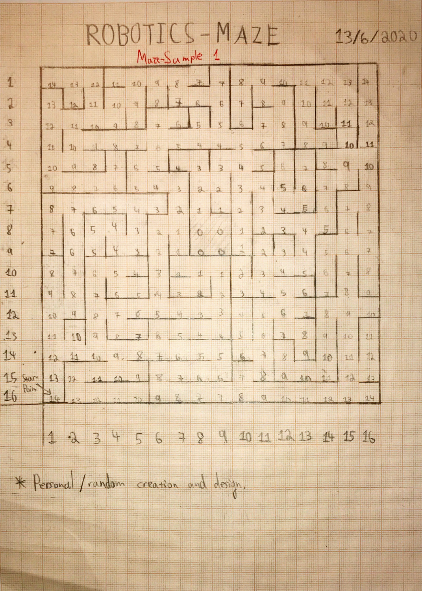
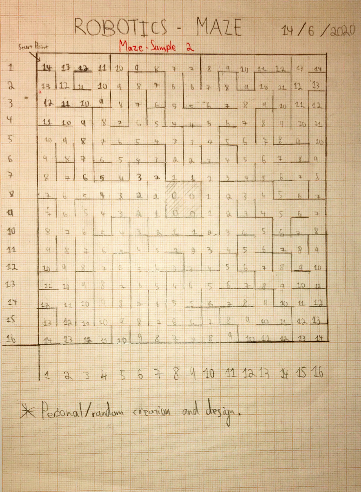
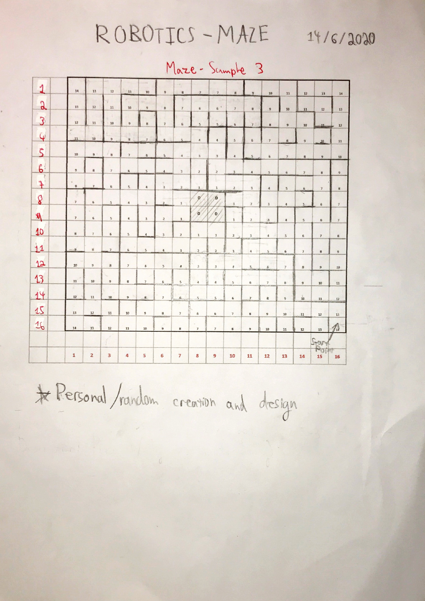
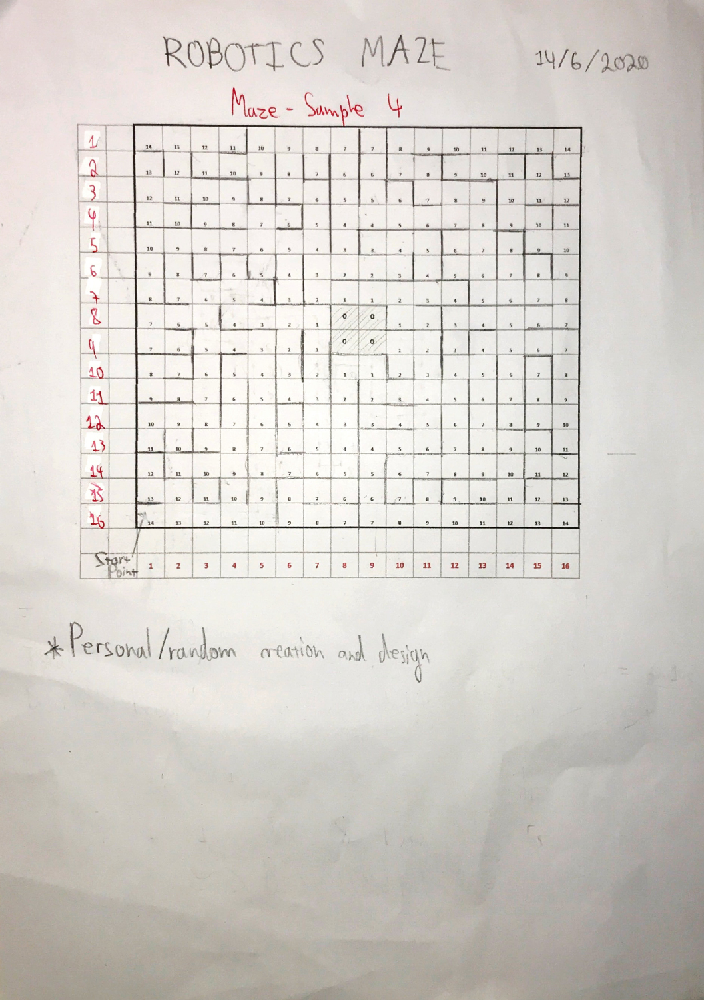
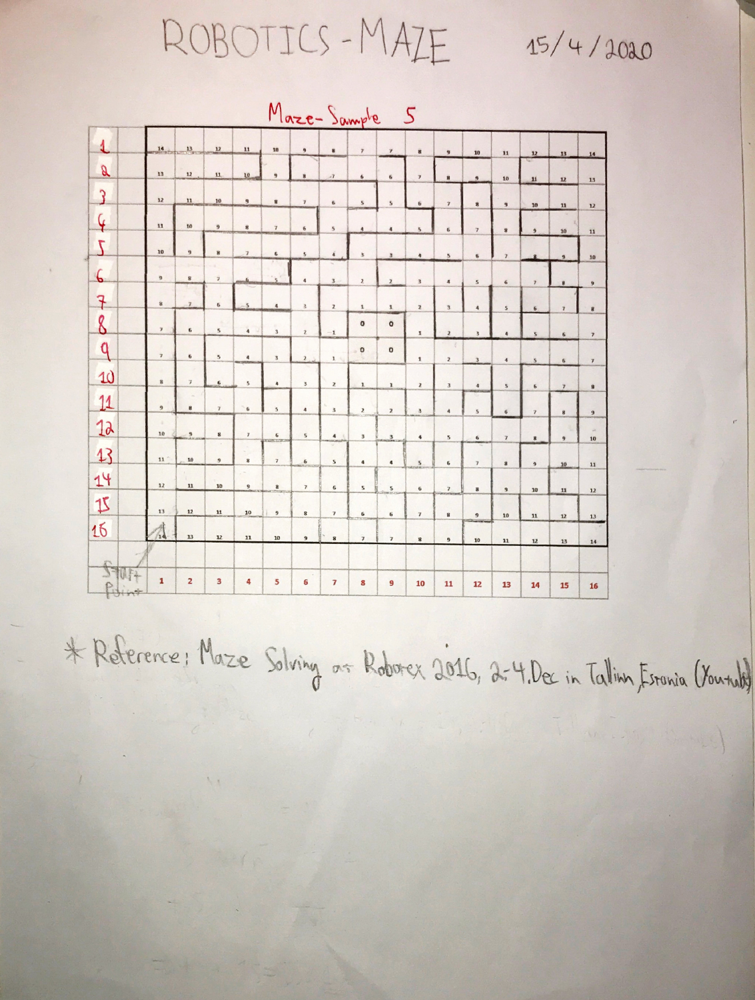
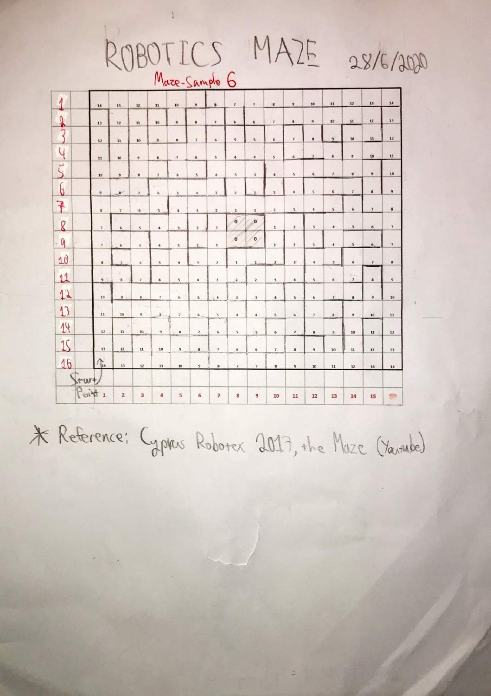

# Performance Results

I tested the Version 3 algorithm ([mazeSolver-V3.c](../src/macos/mazeSolver-V3.c)) on 6 different mazes. Here are the results.

## Test Setup

- **Date**: June 28, 2020
- **Algorithm**: Version 3 (Flood-Fill + Restart Logic + Extended Sensor Logic)
- **Time estimates**: Based on LEGO EV3 speed (2 sec per cell forward, 3 sec per turn)
- **Success criteria**: Reach any of the 4 center cells of the maze

---

## Maze 1: Complex Island Design

**Details:**
- Type: Closed design with islands
- Walls: 282
- Custom designed

**Result:**
- ✅ **SUCCESS** - Reached center
- First attempt: 2m 32s (reached center)
- Second attempt: 1m 2s (optimal path!)
- Total time: 3m 34s

---

## Maze 2: Open Design

**Details:**
- Type: Open design
- Walls: 190
- Custom designed

**Result:**
- ✅ **SUCCESS** - Found optimal path on first try!
- First attempt: 1m 50s (optimal)
- Total time: 1m 50s

**Note:** Open mazes work great with flood-fill - found the best path immediately.

---

## Maze 3: Competition Maze (2018)

**Details:**
- Type: Semi-open with islands
- Walls: 212
- From: Robotex 2018

**Result:**
- ✅ **SUCCESS** - Reached center on second attempt
- First attempt: 2m 32s (got close - reached cell next to center)
- Second attempt: 1m 12s (reached center)
- Total time: 3m 44s

---

## Maze 4: Corridor Design

**Details:**
- Type: Open with long corridors
- Walls: 172
- Custom designed

**Result:**
- ✅ **SUCCESS** - Optimal path on first try!
- First attempt: 1m 52s (optimal)
- Total time: 1m 52s

**Note:** This maze shows off the V3 corridor optimization feature.

---

## Maze 5: Competition Maze (2019)

**Details:**
- Type: Very open
- Walls: 168
- From: Robotex 2019 (likely)

**Result:**
- ✅ **SUCCESS** - Optimal path on first try!
- First attempt: 1m 24s (optimal)
- Total time: 1m 24s

**Note:** Competition mazes are usually open design, which is perfect for this algorithm.

---

## Maze 6: Arduino Competition

**Details:**
- Type: Very dense, closed design
- Walls: 312
- From: Arduino competition (different platform)

**Result:**
- ⚠️ **INCOMPLETE** - Ran out of time
- Got to one cell away from center: 4m 4s
- This maze was designed for Arduino robots which are much faster than LEGO EV3

**Note:** The algorithm worked correctly but the hardware would be too slow for this maze. With more time or faster hardware, it would have completed.

---

## Summary

| Maze | Type | Result | Time |
|------|------|--------|------|
| 1 | Complex | ✅ Reached center | 3m 34s |
| 2 | Open | ✅ Optimal path | 1m 50s |
| 3 | Competition | ✅ Reached center | 3m 44s |
| 4 | Corridors | ✅ Optimal path | 1m 52s |
| 5 | Competition | ✅ Optimal path | 1m 24s |
| 6 | Arduino | ⚠️ Close but timed out | 4m 4s |

**Overall:**
- **5 out of 6 mazes** reached the center (83%)
- **3 out of 6 mazes** found optimal path on first try (50%)
- **0 algorithm failures** - it always found a path when given time

**Conclusions:**

1. **Open mazes**: The algorithm usually finds optimal path immediately
2. **Closed mazes**: Needs 2-3 attempts but reliably reaches center
3. **Hardware matters**: The algorithm is solid, but physical robot speed is the limiting factor for complex mazes
4. **V2 vs V3**: The restart feature (V2) helps a lot in almost any maze layout. The extended sensor optimization logic (V3) only saves time in specific layouts.
